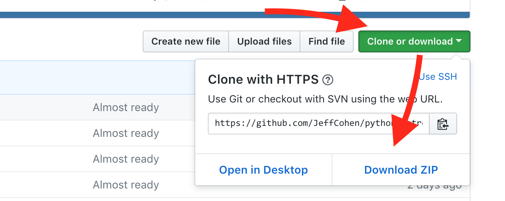

# Introduction to Python 3

### How To Get This Code

**If you are comfortable with git**, just clone this repo.

**Alternatively,** click the green "Clone or download" button and
select **Download ZIP**.  Unzip the file to a directory that
you can easily get to from your Terminal.



---

### Workshop Prerequisites

* Some amount of programming in another language
* A text editor
* A shell environment (Terminal, etc.)
* Python 3.x (3.6 or higher preferred)
* Optional: the "JSON Formatter" extension for Chrome

### Google-able Agenda

Google for these topics by prefixing them with "python",
i.e. "python conditional statements"

**1:30pm - 2:30pm**
* Python Quick Start
  * Variables
  * Case sensitivity
  * Built-in types: `int`, `str`, `float`
  * User input
  * A word about quotation marks
  * Writing scripts
    * Printing to the screen
    * LAB: `1_quotes.py`
* Collections
    * `list`
    * `tuple`
    * `dict`
    * `range`
* Logic (Typealong: 2_password.py)
  * Boolean logic: `True`, `False`, `and`, `or`, `not`
  * Conditional statements
  * Indentation
  * Loops
    * `while`
    * `for`
  * LAB: `3_planets.py`
* Sequences
  * `str`, `list`, `tuple`
  * Slicing
* Defining functions
  * Return values
  * The special value `None`
  * The `pass` statement
  * Accepting parameters to functions
  * Keyword arguments
  * LAB: `4_solar_system.py`
  * LAB: `5_sears_tower.py`

**2:30pm - 3:30pm**
* Types and type conversions
* Strings
  * Immutability
  * f-Strings
  * Multiline strings
* File I/O
* Modules
  * Using modules with the `import` statement
  * `from ... import ...`
  * `__main__`

**3:30pm - 4:30pm**
* Intro to Unicode: `6_unicode.py`
* Using JSON web services from Python
  * The `json` module
  * `json.loads(str)`
  * `json.dumps(obj)`
  * LAB: `7_astronauts`
  * LAB: `8_geocoding`
  * LAB: `9_divvy.py`


### Python Common Gotcha #1: Assignment Statements

* All assignments are references.
* Assignment operations never make a copy of the value being assigned.
* Multiple references to mutable objects (like lists) can lead to unexpected behavior.


### Python Common Gotcha #2: SSL Certifications

If you get errors like `ssl.SSLError: [SSL: CERTIFICATE_VERIFY_FAILED] certificate verify failed`
then the following two shell commands should install SSL certs for Python on your Mac:

```
$ pip3 install certifi
```

then: (this example is for 3.6)

```
$ /Applications/Python\ 3.6/Install\ Certificates.command
```
